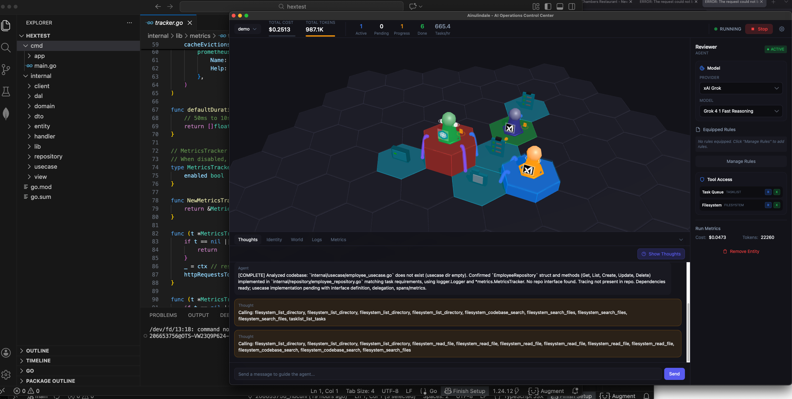

# Ainulindale

**Note:** This project is in very early stages of development. Morgoth hasn't been defeated yet. 

Ainulindale [eye-new-lin-dah-lee] (or Ainu for short) is a board game interface for real-time orchestration of persistent agent swarms. It attempts to move beyond traditional chat-based interactions, 20 terminal windows, or flowcharts to a spatial management system where developer intent is expressed through the topology of a hex grid.



## Third Wave Vibe Coding

Ainulindale is designed for high-leverage, 10% attended operations. It treats agents as independent actors governed by the physics of the board rather than centralized orchestration.

The system visualizes AI workflows as a hex grid board game. Users place Agents and Tools on the board to add them to the simulation. Physical position on the board implies relationships according to RBAC settings for each tool entity. By decoupling agents from the board's global state, the system enables emergent behaviors and complex feedback loops.

Instead of adding guard rails to prevent feedback loops, conflicting operations, and other "accidents", Ainulindale embraces them. Interesting and productive emergent behavior is the goal. With this level of freedom comes great responsibility. It is up to the user to design boards that achieve the desired outcomes.

Ainulindale is opinionated when it comes to how application layer chain of thought is created and maintained. The engine enforces a stateless, functional approach to intelligence. Models perform best on well-defined, atomic tasks with high-density context. Therefore:
- Every new work item triggers a complete context rebuild from an empty state.
- Tokens are spent finding relevant information via local RAG and tools to ensure the agent's thought process remains tight and focused.
- This prevents context poisoning and logical drift common in long-lived persistent sessions.

Tokens spent reconstructing the agents context for each task theoretically offset the need for expensive memory tokens.

## Core Concepts

### Adjacency and Range of Effect
Access is determined by the "Range of Effect" slider and directional zones.
- **Hexes**: Processing slots for Agents or Tools.
- **Adjacency**: Entities within a tool's range automatically gain access based on their directional orientation.
- **Scaleable Range**: Permissions are treated as a field. A single tool can radiate access to a local cell (Range 1) or an entire department (Range 3+).

### Equippable Rulesfiles
Agents are configured via a modular inventory system. Instead of static prompts, agents use "equippable" rulesfiles, markdown-based standards for specific languages, architectures, or workflows. This allows for hot-swapping agent personalities without reconfiguring the board.

### Dynamic System Prompt Generation
The system prompt is JIT-compiled for every task iteration. The BoardRunner assembles a 7-section prompt:
1. Environment (Identity, Platform, Workspace)
2. Tool Definitions (Filtered by RBAC)
3. Behavioral Guidelines
4. Role Guidelines (Template-specific)
5. Task Completion Protocols
6. Equipped Rulefiles (Modular inventory)
7. Custom User Instructions

## Entity Types

### Agent Providers

Ainulindale uses the **Vercel AI SDK** for unified LLM access with native function calling. This allows you to use any LLM provider or model that you like. Some models are better than others for certain tasks. Ainulindale lets you configure what provider to use for what agent rather than obfuscated model routers. The currently supported providers are:

- **OpenAI** 
- **Anthropic** 
- **DeepSeek**
- **Google Gemini** 
- **Cohere** 
- **Mistral** 
- **Ollama** 
- **Grok (xAI)** 

### Tool Providers

Tools provide capabilities for agents. These built in tools use a rust backend to provide the necessary OS level functionality. The currently supported tools are:

- **Filesystem** - Sandboxed file access (read, write, list, search, codebase search)
- **Shell** - Execute shell commands
- **Tasklist** - In-memory task queue with pull-based claiming

## Technical Features

### Event-Driven Architecture
Hex entities run as persistent actors on a central event bus.
1. **Emission**: Tools emit events (filesystem.changed, tasks.available).
2. **Subscription**: RBAC controls which agents can consume which events.
3. **Reaction**: Agents wake up and claim work items based on events occurring within their permitted zones.

This creates a self-organizing swarm where data flows through the grid based on the spatial layout rather than hard-coded logic.

### Codebase Search (RAG)
The local RAG system provides semantic code search:
- **Tree-sitter Parsing**: Chunks code into complete semantic units (functions, classes, structs).
- **Local Embeddings**: FastEmbed (AllMiniLM-L6-v2) for private, zero-latency inference.
- **Vector Storage**: Per-hex isolation using sqlite-vec.

### Budget Tracking and Heat Maps
The system provides visual and financial guardrails:
- **Two-Tier Tracking**: Monitor lifetime costs (Dollars) and per-run usage (Tokens).
- **Hex Height Visualization**: Hexes grow in height during execution based on token usage, creating a real-time heat map of swarm activity.
- **Automatic Cutoffs**: The board stops automatically when budget limits are exceeded.

### Plugin-Based Tools
Tools are implemented as self-describing plugins that register with a central registry:
- **Self-Registration**: Plugins declare their own identity, configuration schema, and available tools.
- **Auto-Generated UI**: Configuration panels are derived from JSON Schema - no hardcoded forms.
- **Zod Validation**: Tool parameters use Zod schemas for type-safe AI SDK integration.
- **Lifecycle Hooks**: Plugins can implement `initialize`, `dispose`, and `healthCheck` for resource management.
- **Environment Awareness**: Plugins declare availability (e.g., Tauri-only tools won't appear in browser).

Adding a new tool type requires only implementing the `ToolPlugin` interface and calling `pluginRegistry.register()`.

## Development

```bash
git clone https://github.com/im-knots/ainulindale.git
cd frontend

# Install deps
npm install

# Run tests
npm run test           # Unit tests (Vitest)
npm run test:watch     # Watch mode

# Type checking
npx tsc --noEmit

# Run dev server
npm run tauri:dev

# Build
npm run build
npm run tauri build    # Native app
```

## Tech Stack

- **Frontend**: React, TypeScript, Vite, Three.js
- **Desktop**: Tauri v2 (Rust backend)
- **LLM**: Vercel AI SDK (multi-provider)
- **Storage**: SQLite (via Tauri), sqlite-vec (vector search)
- **Embeddings**: FastEmbed (AllMiniLM-L6-v2, local inference)
- **Parsing**: Tree-sitter (syntax-aware code chunking)
- **Testing**: Vitest (unit), Playwright (E2E)

## Documentation

**[Getting Started](docs/getting-started.md)** - Learn how to play the game

See the `docs/` directory for detailed documentation:

- [Agents and Tools](docs/agents-and-tools.md) - Entity types, templates, and operations
- [RBAC System](docs/rbac-system.md) - Zone patterns and permissions
- [Budget System](docs/budget-system.md) - Two-tier cost tracking and limits
- [System Prompt Generation](docs/system-prompt-generation.md) - Dynamic prompt composition
- [Agent State](docs/agent-state.md) - Chain of thought and context construction
- [Board Execution](docs/board-execution.md) - Event system and actor lifecycle
- [Codebase Indexer](docs/indexer.md) - RAG-powered semantic code search

## License

MIT

